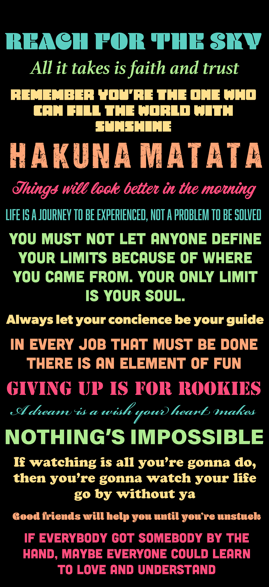

<!DOCTYPE HTML>
<html>
    <head>
        <title> “Good Vibes Manifesto” </title>
        <link rel="stylesheet" href="melissa_site/css/styles2.css">
        <link href="https://fonts.googleapis.com/css2?family=Righteous&display=swap" rel="stylesheet">
        <link href="https://fonts.googleapis.com/css2?family=Cabin&family=Modak&family=Righteous&display=swap" rel="stylesheet">
        <link href="https://fonts.googleapis.com/css2?family=Lato&display=swap" rel="stylesheet">
  </head>

  <body>
      

          <h1> Good Vibes Only </h1>
          <a href= "melissa_site/cantrell_melissa_manifesto_5.html"> Good Vibes Manifesto </a>
          <a href= "melissa_site/manifestocopy.html"> More Good Vibes </a>
          <a href= "melissa_site/cantrell_melissa_manifesto_2.html"> Better Vibes </a>
          <a href= "melissa_site/cantrell_melissa_manifesto_1.html"> The Best Vibes</a>
  </body>

        

            
            <a href= "https://www.instagram.com/melmel__82/"
        

          <small>by Melissa Cantrell</small>
        

</html>
